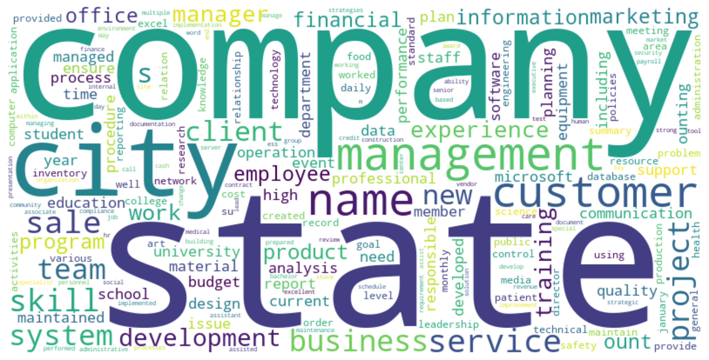
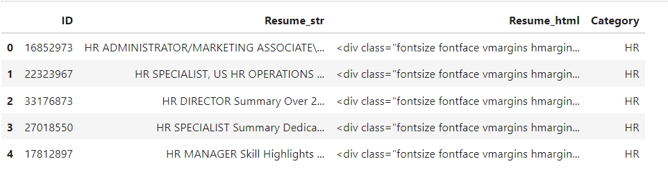

# Resume Categorization
<div align="center">

</div>
This project focuses on classifying resumes into different professional domains such as HR, DESIGNER, FINANCE, etc. The classification is performed using various machine learning algorithms and the best one is finally selected.

## Project Overview

The goal of this project is to automatically classify resumes based on their content into predefined domains (e.g., HR, ACCOUNTANT, HEALTHCARE, TEACHER). Such classification is useful in recruitment processes to quickly categorize incoming resumes, allowing recruiters to focus on relevant applications.

## Project Structure
```bash
├── assets
├── dataset
├── model
│   ├── bow_vectorizer.pkl
│   └── gradient_boosting_model.sav
├── Resume
│   ├── Resume.csv
├── test_resumes
│   ├── 10030015.pdf
│   │   ............
│   └── 10219099.pdf
├── test_resumes_categorization
│   ├── ACCOUNTANT
│   │   ............
│   └── AUTOMOBILE
├── categorized_resume.csv
├── environment.yml
├── README.md
├── resume_classification.ipynb
└── script.py
```

## Table of Contents

- [Dataset](#dataset)
- [Installation](#installation)
- [Usage](#usage)
- [Preprocessing](#preprocessing)
- [Machine Learning Algorithms](#machine-learning-algorithms)
- [Performance Evaluation](#performance-evaluation)
- [Best Model Selection](#best-model-selection)
- [Results](#results)
- [Future Work](#future-work)
- [Contributing](#contributing)

## Dataset

The dataset contains resumes in their corresponding domain folders. Each resume is represented as a ```.pdf``` document, and the ```folders_name``` represent the professional domain, such as "HR," "ACCOUNTANT," "AGRICULTURE," etc. And another `Resume.csv` file is provided which is the dataset with proper format and in this project I worked on `Resume.csv`.

### Data Structure
- `Resume.csv`: The CSV file contains four columns: 
  - `ID`: Resume (pdf) file name.
  - `Resume_str`: The resume text extracted from each resume.
  - `Resume_html`: The resume text in html format.
  - `Category`: The domain label for the resume.

### Sample Data
``` Example of Some data in pd.dataframe format```
<div align="center">

</div>

## Installation

To run this project locally, you'll need to install the required dependencies. The code could be run on ``Jupyter Notebook``,`VSCode` etc. 

#### Prerequisites
- Anaconda
- Python 3.x
- Jupyter Notebook (optional)

#### Installing Dependencies
1. Clone the repository:
```bash
git clone https://github.com/your-username/mnist-classification.git
cd mnist-classification
```
2. Create a virtual environment and activate it:
```bash
conda env create -f environment.yml
conda activate resume_classification
```

This will create an virtual anaconda environment and install the necessary `requirement` packages and libraries automatically. The `environment.yml` file contains the following dependencies and packages:
- `numpy`
- `pandas`
- `scikit-learn`
- `nltk`
- `nltk`
- `matplotlib`
- `PyPDF2`
- `shutil`
- `wordcloud`

###### !!! REMAINDER !!! REMAINDER !!! REMAINDER
If you don't know you to add anaconda environment in jupyter notebook then please follow this command / otherwise skip this part:
```bash
1. conda activate resume_classification
2. conda install -c anaconda ipykernel
3. python -m ipykernel install --user --name=resume_classification
```
These three commands will add the virtual environment in jupyter notebook.

## Usage

1. Clone the repository:

   ```bash
   git clone https://github.com/yourusername/resume-classification.git
   cd resume-classification
   conda activate resume_classification
   ```
##### FOR TESTING FOLLOW THIS
2. For inferencing the performance add some `.pdf` document in a `folder` and run the following script.
   ```bash
   python script.py directory_of_resume
   ```
This will classify and move the resume to the corresponding destination folder (i.e., `test_resumes_categorization`).

###### FOR TRAINING AND CHECKING DETAILS FOLLOW THIS
3. Preprocess the data and train the models by running the provided Jupyter Notebook or Python script:

   ```bash
   jupyter notebook resume_classification.ipynb
   ```

## Preprocessing
1. **URL Removal**: Any URLs present in the text were removed.
2. **Mention Removal**: Mentions (e.g., @username) were removed to avoid unnecessary noise.
3. **Hashtag Removal**: Hashtags (e.g., #example) were removed from the text.
4. **Punctuation Removal**: All punctuations were removed to simplify the text.
5. **Non-ASCII Characters Removal**: Any non-ASCII characters were removed to ensure uniformity.
6. **Whitespace Normalization**: Extra whitespace was removed to maintain consistent spacing.
7. **Lowercasing**: All text was converted to lowercase to reduce variability.
8. **TF-IDF Vectorization**: The cleaned text was transformed into numerical features using the Term Frequency-Inverse Document Frequency (TF-IDF) method.
9. **Continuous Bag of Words (CBOW)**: The text data was also processed using the CBOW model to capture context-based word embeddings.

## Machine Learning Algorithms

Multiple machine learning algorithms were implemented and evaluated to find the best model for classifying resumes:

1. **Logistic Regression**
2. **Support Vector Machines (SVM)**
3. **Decision Tree Classifier**
4. **K-Nearest Neighbors (KNN)**
5. **Random Forest Classifier**
6. **Bagging Classifier**
7. **Gradient Boosting Classifier**


## Performance Evaluation

The performance of the model was evaluated using the following metrics:

- **Accuracy**
- **Precision**
- **Recall**
- **F1-Score**

## Best Model Selection

After comparing the performances of various models on `.ipynb` file, among the selected machine learning models **Gradient Boosting** was selected as the final model for evaluating on the test dataset due to its superior performance across all metrics.

### Summary of Results

| Algorithm              | Accuracy | Precision | Recall | F1-Score |
|------------------------|----------|-----------|--------|----------|
| **Gradient Boosting**   | **78.28%**  | **80.29%**   | **78.28%** | **78.20%** |


## Results

The Gradient Boosting model achieved an accuracy of `78.28%` on the test set, outperforming other models like Logistic Regression, SVM, and Random Forest and other models on initial investigation. It demonstrates robust classification performance across different domains, including HR, Accounting, Software Engineering, and Marketing.


## Use Cases
- Automated Screening
- Talent Pool Management
- Personalized Job Recommendations
- Efficiency in Recruitment
- Compliance and Record Keeping

## Future Work

- **Model Optimization**: Further tuning of hyperparameters can be done to improve performance.
- **Deep Learning**: Explore deep learning approaches like Multi-layer Perceptron, LSTM or BERT-based models to improve the accuracy further.
- **Real-Time Application**: Integrate the model into a web-based application for real-time resume classification.
- **Expand Dataset**: Collect more diverse resumes to improve generalization across different domains.

## Contributing

Contributions are welcome! Please open an issue or submit a pull request for any improvements or new features you'd like to add.

